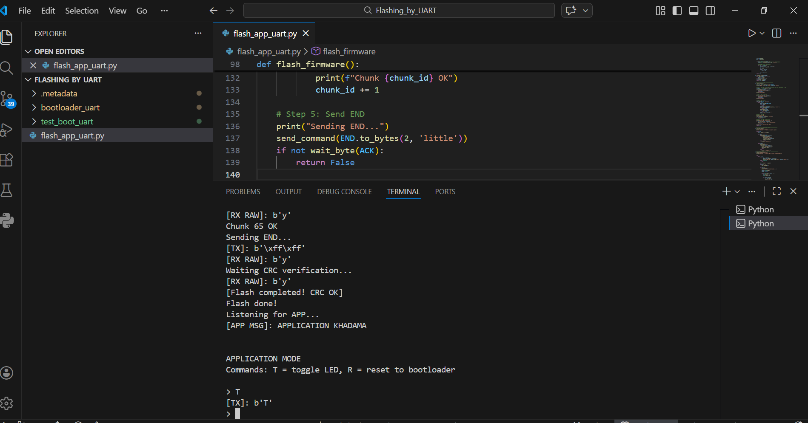

# STM32F411RE — Custom UART Bootloader

Custom bare-metal UART bootloader for STM32F411RE with CRC32 firmware verification and a Python host script.

---

## How It Works

```
┌─────────────────────────────────────────────────────┐
│                  STM32F411RE Flash                  │
│                                                     │
│  0x08000000        0x08020000          0x08080000   │
│  ┌──────────────┐  ┌──────────────┐                 │
│  │  Bootloader  │  │ Application  │                 │
│  │   128 KB     │  │    64 KB     │                 │
│  └──────────────┘  └──────────────┘                 │
└─────────────────────────────────────────────────────┘

  PC (Python Script)
        │
        │  UART 115200
        │
  STM32 USART2 (PA2/PA3)
        │
        ▼
  Bootloader receives 'P', 'F', or 'J'
        │
   'P' ─┤─► ACK (ping — sync only, no side effects)
   'F' ─┤─► Receive CRC → Erase → Flash chunks → Verify CRC → Jump to App
   'J' ─┘─► Jump directly to App
```

---

## Flash Protocol

```
Python                  Bootloader
──────────────────────────────────
  'P'          ──►                   (sync ping — optional)
               ◄──   ACK
  'F'          ──►
               ◄──   ACK
  CRC32 (4B)   ──►
               ◄──   ACK
                      [Erase flash]
               ◄──   ACK
  SIZE + DATA  ──►
               ◄──   ACK  (repeat per chunk, 128B each)
  END 0xFFFF   ──►
               ◄──   ACK
                      [Verify CRC32]
               ◄──   ACK  → Jump to App
               ◄──   ERR  → Erase & wait
```

---

## App → Bootloader Reset Flow

```
Application running
        │
  User sends 'R'
        │
        ▼
  App: wait TC flag → NVIC_SystemReset()
        │
        ▼
  Bootloader starts (HAL_Init → Clock → UART)
        │
        ▼
  Python: sleep(1) → reset_input_buffer()
        │
        ▼
  bootloader_mode() → user chooses F or J
```

> `sleep(1)` guarantees bootloader finishes initialization before Python sends any command.  
> For production use, replace with `P` ping handshake for 100% reliability.

---

## Demo


> Firmware flashed successfully — 65 chunks transferred, CRC verified, application started and LED toggled.

---

## Project Structure

```
Flashing_by_UART/
├── bootloader_uart/       # Bootloader @ 0x08000000
│   └── Core/Src/
│       ├── main.c         # Command handler (F / J / P)
│       └── flash_if.c     # Flash / CRC / Jump API
├── test_boot_uart/        # Application @ 0x08020000
│   └── Core/Src/
│       └── main.c         # LED toggle + reset to bootloader
└── flash_app_uart.py      # Python host script
```

---

## Usage

```bash
pip install pyserial
python flash_app_uart.py
```

| Mode        | Command | Action                          |
|-------------|---------|----------------------------------|
| Bootloader  | `P`     | Ping — sync check (ACK only)    |
| Bootloader  | `F`     | Flash new firmware               |
| Bootloader  | `J`     | Jump to app                      |
| Application | `T`     | Toggle LED                       |
| Application | `R`     | Reset to bootloader              |

---

## Sync Design — Why `P` Ping?

The sync loop uses `P` instead of `F` to avoid accidentally triggering a flash operation during bootloader detection:

```
Without P:  sync sends F → Boot_HandleFlash() starts → state corrupted
With P:     sync sends P → ACK only → bootloader stays in main loop → clean state
```

`P` = "are you there?" — no side effects, safe to send repeatedly.

---

## Status

| Feature                        | Status  |
|--------------------------------|---------|
| Bootloader @ 0x08000000        | Done  |
| Application @ 0x08020000       | Done  |
| Flash protocol (chunked UART)  | Done  |
| CRC32 firmware verification    | Done  |
| RAM execution (Erase/Write)    | Done  |
| Boot → App jump (J)            | Done  |
| App → Bootloader reset (R)     | Done  |
| SHA-256 firmware integrity     | Next  |
| ECDSA firmware authentication  | Next  |

---

## Future Improvements

- [ ] **SHA-256 + ECDSA** — Secure boot with firmware signing (Python `cryptography` + `micro-ecc` on STM32)
- [ ] **UDS (ISO 14229)** — Diagnostic services over UART/CAN (0x34 / 0x36 / 0x37)
- [ ] **AUTOSAR BSW** — Abstract flash driver using AUTOSAR MemIf / Fls module interface
- [ ] **XMODEM** — Standard transfer protocol support
- [ ] **CAN Bootloader** — Flash over CAN bus (automotive standard)

---

## Author

**Said** — Embedded Systems Engineer  
STM32F411RE · UART Bootloader · CRC32 · 2026
